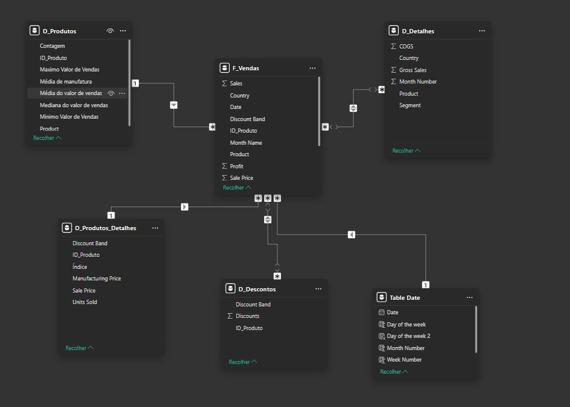

# Star-Schema DIO-Project

## Projeto 

O projeto consiste em utilizar os dados da tabela financial sample que é um modelo de exemplo disponibilizado pelo Power BI, para criar um modelo de dados Star Schema.

## Modelo Inicial 

Inicialmente nosso modelo utiliza a financial sample, e o modelo fica como mostrado na imagem abaixo. 

Como podemos ver acima o modelo inicialmente tem três tabelas, a tabela financial, Table Date e a budget, podemos observar que a Table Date se relaciona com as outras duas Tabelas.

## Star Schema  

Podemos notar no topico acima que Não tem nada de errado com o modelo inicial disponibilizado pelo Power BI, é completamente Possivel utilizá-lo para criação dos nossos dashboards e relatórios. 

Bom se não tem nada de errado com o modelo porque iremos mudar então?. Pois o modelo Star-Schema nesse nosso exercício aqui vai nos permitir ter um melhor desempenho na hora de analisar esses dados pelo fato dele ser menos dependente de QUERYs(consultas) que podem diminuir o desempenho do nosso modelo, além de ser muito mais simples e intuitivo também melhora a visualização dos dados.

## Modelo Final 

Se compararmos o modelo inicial com o modelo final podemos notar uma quantidade maior de tabelas, ao todo são seis sendo uma tabela-Fato e cinco tabelas-Dimensão, e podemos notar como os dados estão sendo disponibilizados aqui, em comparação com o modelo inicial podemos ver uma melhor categorização e divisão desses dados, possibilitando uma consulta muito mais dinâmica e eficiente. 

## Considerações Finais

Apenas Lembrando que essa é uma versão muito simplificada desse modelo não contemplando aqui todos os seus pontos positivos e negativos, apenas dando minha visão sobre tal. 

Se quiser entender um pouco mais da minha visão sobre o assunto tem esse outro [projeto](https://github.com/luiz315/Diagrama-Entidade-Relacionamento-Star-Schema.git) bem legal também aqui no meu perfil.

